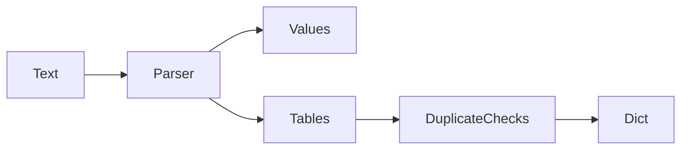

# tomlmini

A small, readable TOML common-subset parser that rejects ambiguous edges loudly.

**Thesis:** a config parser can be useful even when it does not chase every
corner of a format. `tomlmini` covers the TOML shapes most projects actually
use and makes unsupported ambiguity explicit.

## Run It In 30 Seconds

```bash
python -m pip install -e ".[dev]" && python examples/parse_config.py
```

## Why Care?

- You want a reference-quality parser small enough to read.
- You want conformance checks against `tomllib` for supported shapes.
- You prefer explicit parse errors over silent table/key merging surprises.

## Example

```python
import tomlmini

config = tomlmini.loads('''
title = "demo"
[server]
port = 8080
''')
assert config["server"]["port"] == 8080
```

## Architecture



## Supported

Tables, dotted keys, arrays of tables, inline tables, strings, booleans,
integers, floats, dates, times, and datetimes for the common TOML 1.0 subset.

## Limitations

- Parser only; no `dumps`.
- Not a full TOML replacement.
- Ambiguous dotted-key/table-header edge cases are rejected rather than merged.

## Development

```bash
python -m pip install -e ".[dev]"
ruff check .
mypy --strict src/tomlmini
pytest
python scripts/conformance_smoke.py
```

See [ARCHITECTURE.md](docs/ARCHITECTURE.md), [TECHNICAL_ARTICLE.md](docs/TECHNICAL_ARTICLE.md), and [RELEASE.md](RELEASE.md).
